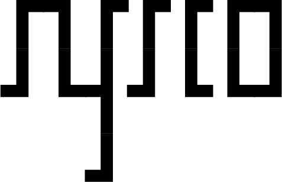

<p align="center">
  <a href="README.md">English</a>  •  <a href="LEEME.md">Español</a>  •  <a href="LISMOI.md">Français</a>  •  <b>Deutsch</b>
</p>
<br>

<h1 align="center">Wo es ein Problem gibt, gibt es eine Lösung, die programmiert werden muss.</h1>

<p align="center">
  Lernen, schreiben, brechen, verbessern. Denn Selbststudium ist die Kunst, sich selbst zu lehren, und Wissen gehört den Neugierigen.<br><br>
  <br><br><br>
  <a href="https://syyysco.github.io">Besuchen Sie meine Webseite</a>
  
</p><br>

## Fachbereiche
### 💻 Softwareentwicklung
- __`Python`__: Von Automatisierungsskripten bis hin zu grafischen Anwendungen und Pentesting-Tools
- __`Bash`__: Jeden versteckten Winkel von Linux erkunden

<br>

### 🛡️ Cybersicherheit
- __`Pentesting`__: Schwachstellen identifizieren, um Abwehrmechanismen zu stärken
- __`Ethical Hacking`__: Die Macht des Wissens nutzen, um die Welt zu verbessern

<br>

### ✎ Grafische Schnittstellen und Design
- __`PyQt6`__: Intuitive und ansprechende Benutzererlebnisse schaffen, immer mit Fokus auf die durch Animationen und Farbschemata vermittelten Empfindungen<br>

<br>

---

## 💡 Filosofía de Desarrollo
```python
def problem_losen(herausforderung):
    while not gelost(herausforderung):
        ansatz = analysieren(herausforderung)
        losung = umsetzen(ansatz)
        if funktioniert(losung):
            return losung
        else:
            aus_fehler_lernen(losung)
    
    return erfolg
```

<br>

## 🌐 Technologisches Ökosystem
- __Betriebssysteme__: Linux (Kali, Ubuntu), Windows<br>
- __Werkzeuge__: Docker, Wireshark, Metasploit, Burp Suite, Nmap, etc.<br>
- __Sprachen__: Python, Bash, SQL, HTML/CSS, JavaScript<br>
- __Editoren__: VSCode, Nvim, Nano, Atom, Sublime 

<br>

## 💠 Neueste Projekte
Werfen Sie einen Blick auf meine neuesten Projekte!<br>

- <a href="https://github.com/Syyysco/Zeven"><b>Zeven</b></a>: Kommandozeilen-Tool in Python entwickelt

<br>

## 🔗 Zusammenarbeit und Kontakt
Haben Sie eine revolutionäre Idee oder eine faszinierende technische Herausforderung? Lassen Sie uns sprechen! Ich bin immer offen für innovative Projekte.<br>

E-Mail:  <a href="mailto:syscodev@proton.me">syscodev@proton.me</a>

---

<br><br><br>

<h2 align="center">LERNER-MENTALITÄT</h1>
<p align="center">
  "Der wahre Hacker ist ein ewiger Lerner, der stets sein Wissen und seine Fähigkeiten erweitert." - <i>Anonymous</i><br>
  "Wissen sollte frei sein." - <i>Anonymous</i><br>
  "Vertrauen Sie keinen Systemen, lernen Sie, wie sie funktionieren." - <i>Edward Snowden</i><br>
  "Hacken bedeutet verstehen, nicht zerstören." <i>(Inspiriert von der Hacker-Kultur)</i><br>
</p>
<br><br>

<h3 align="center">⚠️ Sicherheitshinweis:</h3><br>

```bash
rm -rf /probleme && mkdir /losungen && chmod 777 /innovation
```
<br>
<h4 align="center">(Sicherer Code für das Leben)<br></h4><br>
